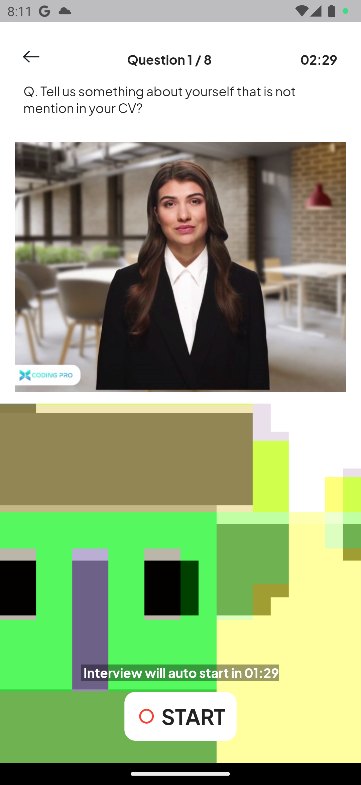
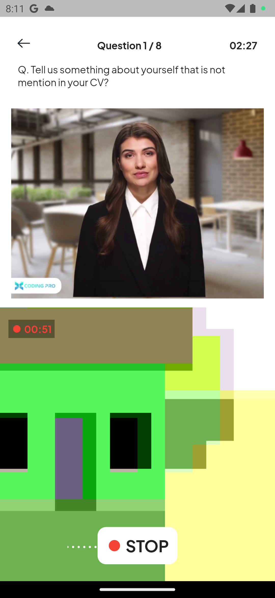
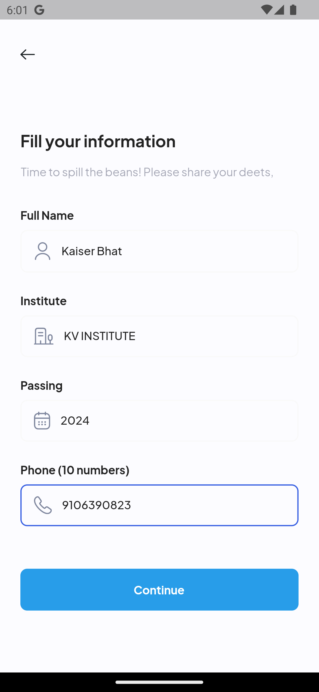

<!-- Improved compatibility of back to top link: See: https://github.com/othneildrew/Best-README-Template/pull/73 -->

<!--

[![Contributors][contributors-shield]][contributors-url]
[![Forks][forks-shield]][forks-url]
[![Stargazers][stars-shield]][stars-url]
[![Issues][issues-shield]][issues-url]
[![MIT License][license-shield]][license-url]
[![LinkedIn][linkedin-shield]][linkedin-url]

-->

<!-- PROJECT LOGO -->
 

   

<h1 align="center">AIHire : Interview Preparation App</h1>

  

     A Flutter-based app that provides Face-to-face virtual interviews with AI Interviewer by Recording user's voice and actions through device sensors. In the end, it provides an in-depth report of the interview by applying ingenious AI Prompting on Chat GPT - 3.5.
     
    <a href="https://github.com/OracleYT/aihire-demo"><strong>Explore the docs »</strong></a>
     
     
    <a href="https://youtube.com/shorts/lUUmg6Krxqs">View Demo Video</a>
    ·
     <!--
    <a href="https://github.com/github_username/repo_name/issues">Report Bug</a>
    ·
    <a href="https://github.com/github_username/repo_name/issues">Request Feature</a>
     -->
  

<!-- ABOUT THE PROJECT -->
## About The Project

<table>
  <tr>
      <th>
        
      </th>
     <th>
        
      </th>
     <th>
        
      </th>
  </tr>
</table>

### Built With

* [![flutter][flutter.js]][Next-url]
* [![html][html.js]][Next-url]
* [![chat][chat.js]][Next-url]

<!-- GETTING STARTED -->
## Getting Started

The **AI-Enhanced** Virtual Interview Platform is an innovative mobile application developed using the **Flutter** framework. This application serves as a comprehensive solution for conducting **face-to-face** virtual interviews, utilizing advanced artificial intelligence (**AI**) technologies to enhance the interview experience and **evaluate candidates** more effectively.

### Features

1. `Virtual Interviews`:

The app allows users to **participate** in virtual interviews from the comfort of their **own** **space**.

2. `Device Sensor Integration`:

The application leverages device sensors such as the **camera** and microphone to capture the **user's** **facial** expressions, voice, and gestures during the interview process. This data is then **analyzed** by the AI Interviewer.

3. `AI Prompting using ChatGPT - 3.5`:

The app employs the cutting-edge **ChatGPT - 3.5** model to provide AI-powered interview prompts.

4. `In-Depth Interview Reports`:

After the interview concludes, the app generates a **detailed report** that includes an analysis of the candidate's **performance**. The report highlights strengths, areas for improvement, and suggestions for enhancing interview skills.

5. `User-Friendly Interface`:

The app features an intuitive and **user-friendly interface**, making it easy for both candidates and interviewers to navigate through the interview process.

   

<!-- Target audience -->
## Conclusion

The AI-enhanced virtual Interview Platform is designed to **revolutionize** the interview process by combining advanced AI technologies with the convenience of a **mobile application**. This project showcases the capabilities of Flutter and the powerful **AI** capabilities of ChatGPT - 3.5 to create a seamless and insightful interview experience for both candidates and recruiters.

<!-- CONTACT -->
## Contact

## Prakash Patel - [@linkedin](https://www.linkedin.com/in/prakash-patell/) - patelprakash8087@gmail.

### !NO SOURCE CODE(CAN BE USED BY OTHERS IF DECLARED)

(<a href="#readme-top">back to top</a>)

<!-- MARKDOWN LINKS & IMAGES -->
<!-- https://www.markdownguide.org/basic-syntax/#reference-style-links -->
[contributors-shield]: https://img.shields.io/github/contributors/github_username/repo_name.svg?style=for-the-badge
[contributors-url]: https://github.com/github_username/repo_name/graphs/contributors
[forks-shield]: https://img.shields.io/github/forks/github_username/repo_name.svg?style=for-the-badge
[forks-url]: https://github.com/github_username/repo_name/network/members
[stars-shield]: https://img.shields.io/github/stars/github_username/repo_name.svg?style=for-the-badge
[stars-url]: https://github.com/github_username/repo_name/stargazers
[issues-shield]: https://img.shields.io/github/issues/github_username/repo_name.svg?style=for-the-badge
[issues-url]: https://github.com/github_username/repo_name/issues
[license-shield]: https://img.shields.io/github/license/github_username/repo_name.svg?style=for-the-badge
[license-url]: https://github.com/github_username/repo_name/blob/master/LICENSE.txt
[linkedin-shield]: https://img.shields.io/badge/-LinkedIn-black.svg?style=for-the-badge&logo=linkedin&colorB=555
[linkedin-url]: https://linkedin.com/in/linkedin_username
[product-screenshot]: images/ss1.png
[product-screenshot-2]: images/ss2.png
[php.js]: https://img.shields.io/badge/php-000000?style=for-the-badge&logo=php&logoColor=white
[Next-url]: https://nextjs.org/
[flutter.js]: https://img.shields.io/badge/flutter-20232A?style=for-the-badge&logo=flutter&logoColor=61DAFB
[html.js]: https://img.shields.io/badge/Rest%20API-20232A?style=for-the-badge&logo=Rest%20API&logoColor=61DAFB
[css.js]: https://img.shields.io/badge/css-DD0031?style=for-the-badge&logo=css&logoColor=white
[React-url]: https://reactjs.org/
[Vue.js]: https://img.shields.io/badge/Vue.js-35495E?style=for-the-badge&logo=vuedotjs&logoColor=4FC08D
[chat.js]: https://img.shields.io/badge/Chat%20GPT-000000?style=for-the-badge&logo=gpt&logoColor=4FC08D
[js.js]: https://img.shields.io/badge/JavaScript-000000?style=for-the-badge&logo=javascript&logoColor=4FC08D
[Vue-url]: https://vuejs.org/
[Angular.io]: https://img.shields.io/badge/Angular-DD0031?style=for-the-badge&logo=angular&logoColor=white
[Angular-url]: https://angular.io/
[Svelte.dev]: https://img.shields.io/badge/Svelte-4A4A55?style=for-the-badge&logo=svelte&logoColor=FF3E00
[Svelte-url]: https://svelte.dev/
[Laravel.com]: https://img.shields.io/badge/Laravel-FF2D20?style=for-the-badge&logo=laravel&logoColor=white
[Laravel-url]: https://laravel.com
[Bootstrap.com]: https://img.shields.io/badge/Bootstrap-563D7C?style=for-the-badge&logo=bootstrap&logoColor=white
[Bootstrap-url]: https://getbootstrap.com
[JQuery.com]: https://img.shields.io/badge/jQuery-0769AD?style=for-the-badge&logo=jquery&logoColor=white
[JQuery-url]: https://jquery.com 
